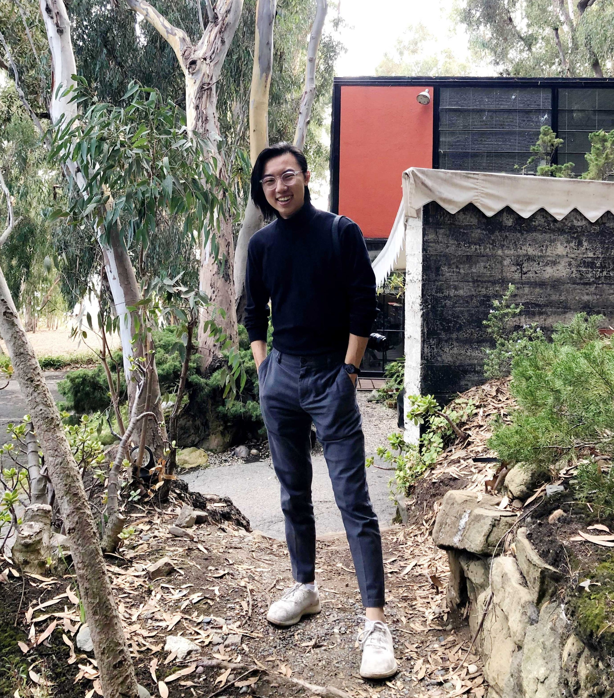

## Hi! Welcome to my personal site.

My name is Jason Liu, and I'm an environmental and development economics student and researcher. Currently, I work as a Junior Project Associate at the University of Chicago Energy & Environment Lab, a joint effort of the UChicago Urban Labs and the Energy Policy Institute of Chicago (EPIC). I mostly work on research projects applying predictive analytics and randomized evaluation to inform policy on greenhouse gas emissions, PM air pollution, and hazardous waste management. In particular, I've worked closely with the California Air Resources Board in Sacramento, CA. 

I'm currently studying Economics and Computer Science at Williams College. Previously, I was a Wilmers Research Fellow for Professor Susan Godlonton in Cape Town, South Africa and did consulting work at the Oxford Development Consultancy for FINCA Haiti, a nonprofit microfinance organization.

I go by they/them pronouns (he/him are okay too!).
